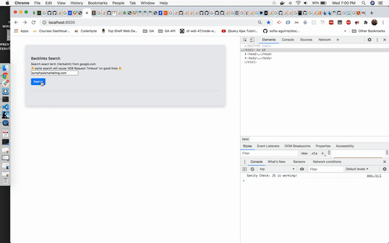

# backlinks
## Add brief info about Puppeteer in this Backlinks project

### Puppeteer is a Node library which control headless Chrome (without browser UI). Without UI (media, image, css, or other time consuming thing) can load the page content much faster.

### Good for scraping, it automates the browser to open page, navigate, keyboard input, clicking, etc...

### Example of scraping / automation, inorder to see it, I turned off headless (now with UI), but I stop 'image','media','font', and 'stylesheet' from loading.

1. Automate scrape: it open the browser to google.com then do a search, filter by verbatim, scrape all links of current page, click next, repeat scrape all links and click next until no more next button.
2. Request each scrape result links for their status code.

### About improve speed
1. I stop media, image, font, and css from loading into web page, (by following tutorial, somewhat working).

### Some necessary wait times
1. When automate scrape, either headless or headful I slow down Puppeteer operations by 0.1 second (see "slowMo" variable). If I don't slow it down contents don't have enough time to load before I can read them. When automate keyboard input it is good to wait a bit before next operations, I wait for 0.05 second after typing (see "delay" variable). When automation might need to way for content load alomost always need to wait until the content loaded (see "waitForNavigation" call function).
2. After scraped all backlinks, check status by request each of them. If url not response immediately, I will wait for 5 seconds (see "waitTime" variable) before treat as request timeout exception. It seen wait longer than 5 second will have less timeout links.

# To install package
npm i

# To run
1. npm run start-dev
2. open chrome to http://localhost:8000/ and open devtool
3. after the page loaded, click search button
4. there should be a popup of chrome doing search by itself
5. while wait the the automation / scrape, look at the coding editor's terminal to see the log
6. if nothing happen, fail, or said some node not found, in terminal crtl-c to stop the run, run again, refresh http://localhost:8000/

